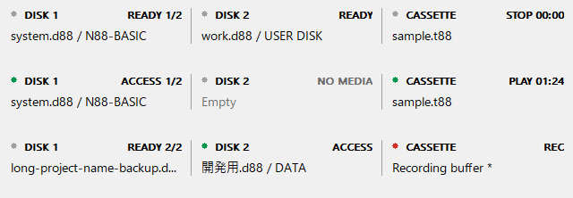

# メディア状態バー（試作）

Windows Win32 GUI の 640×400 画面の下に、メディア状態バーを追加しています。
ファンクションキー表示を含むエミュレータ画面には重ねず、その分だけウィンドウを広げます。
背景・文字・区切り線は Windows のシステム配色に従い、既存のメニューやステータス欄に合わせます。
アクセスランプには緑・赤を使います。

- **DISK 1 / DISK 2**：ファイル名とディスクタイトル。複数枚入りイメージでは選択中の番号も表示。
- **CASSETTE**：セット中の T88 名、現在位置（分:秒）、STOP / PLAY / END。
- **録音**：CMT 送信中は REC。再生テープがない場合は Recording buffer と表示。
- **ランプ**：ディスクアクセスとテープのデータ読み取りは緑、テープのデータ出力は赤。
- **未保存録音**：カセット欄の末尾に `*` を表示。保存操作は `Tape → Save recording as`。

ランプは 50 ms ごとに更新し、短い転送も見えるよう約 180 ms 保持します。
PLAY / REC はモーター・送信状態を示し、ランプは実際のデータアクセスを示します。
テープのリーダー部分などでは、PLAY と表示されていてもデータランプは消えています。
ディスクのランプは FDC のアクセス通知を使い、読み書きは色分けしません。

長い名前は省略表示し、マウスを重ねるとパスとタイトルを確認できます。
各区画を左クリックすると、対応するドライブメニューまたは Tape メニューを開きます。
ディスク未挿入時はイメージを開くメニューを表示します。クリックできる場所ではカーソルが手の形になります。
再生テープと録音バッファは独立しています。T88 をセットしていても、録音はそのファイルへの自動上書きではありません。

既存の `Tools → Show Status` はメッセージ用ステータス欄の表示を切り替えます。
メディア状態バーはウィンドウ表示で常時表示し、全画面では隠します。
今回の試作は Win32 GUI が対象です。raylib GUI の表示変更は含みません。

## 表示例

以下は実装と同じ描画処理で生成したサンプルです。上から待機、ディスクアクセスとテープ再生、録音の例で、ファイル名は架空です。

## 検証

Windows GUI のビルドと ROM 不要の CTest 10 件を実行しました。
テープの読み書き通知、短いディスクアクセスの通知保持、下部の配置、サイズ変更、バーの破棄・再作成を検証しています。
実機 ROM を使った GUI でのディスク・テープ操作は未確認です。
